# ShapeConverter
converts Adobe Illustrator shapes (saved as Adobe Illustrator 8 files) into human readable Processing code

### What ShapeConverter does

ShapeConverter generates Processing code for simple paths found in an Adobe Illustrator 8 file. Using it, you can draw shapes using Adobe Illustrator (or any drawing application that exports Adobe Illustrator version 8 files), and convert those shapes to code that you can use in a Processing app.

Note that the following are NOT supported:
* compound paths
* gradient colours
* multiple document layers

### Why ShapeConverter is useful

Sometimes you may want to draw a simple shape in Illustrator and later on manipulate individual points of it in a Processing app.
If you have complex shapes (i.e. shapes with layers, or multiple colors), then you can use [Geomerative](http://www.ricardmarxer.com/geomerative/) , but this might be overkill for your needs. If you just want to draw some simple shapes and then get the code to draw them in Processing, then ShapeConverter might be what you need. 

I made this project mainly for myself, as I often want to draw my shapes first in Illustrator and then use them inside Processing or openFrameworks. Since I’ve found such a tool very useful for me over the last almost 20 years, I would like to share this one with you. 

For a while I used a self-written Director application, after that I used an Illustrator extension called [Drawscript](https://forums.adobe.com/thread/1175097), but it stopped working at some point. Rather than go through the hassle of learning how to make a an Illustrator plugin, I thought it would be easier and more useful to make my own conversion app instead.

It could be better, I know. Instead of getting one vertex point and one bezierVertex with three points, I could have worked harder so that you get one bezier curve with all 4 points in one line, but I trust in you that you can fix this in your Processing code yourself if you feel the need to. :wink:

### How to use ShapeConverter

#### 1) 
Open Illustrator and create a new file. Set the units to Pixels, and to make things easier, set the width and height to the same size as your Processing project.

(If you set your document size to the same as your Processing project size, you can get an overall idea of how big the shapes will be in your Processing project while you are drawing them in Illustrator.)

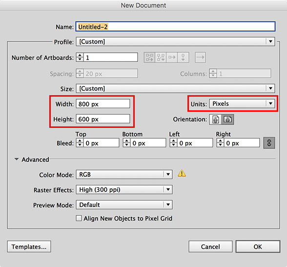

 
#### 2) 
Draw some simple shapes.

The top left corner of your Illustrator art board will have the Processing coordinates x0, y0. 

So if you want to do some fancy rotation later on inside Processing, be aware of the fact, that Processing will rotate around exactly this point (more details below). My recommendation is to use the top left corner either as the starting point, the center point or the end point of the shape.

To keep things simple, set the stroke color to black and set no fill color.

As an example, here’s a shape I made using the pen tool:

Or, you could use any other of the following tools for drawing your shape:

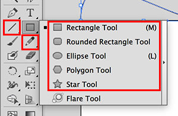

You can draw more than one shape, that’s fine.

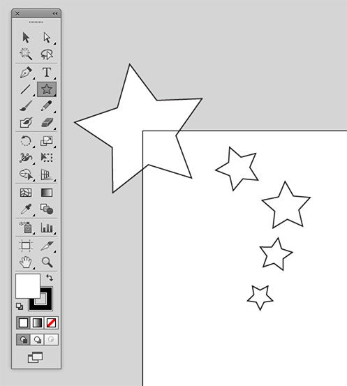

What does NOT work with shapeConverter ?
* compound paths
* gradient colours
* more than one layer
Stay simple and you will be happy with the results of ShapeConverter.

 
#### 3) 
Once you have your shape finished, it is important to export it in the right file format: **Illustrator 8**.

Click File –> Save as

In the Save As dialog enter a name for your file, and make sure the file format ist set to Adobe Illustrator (ai), then click "Save"

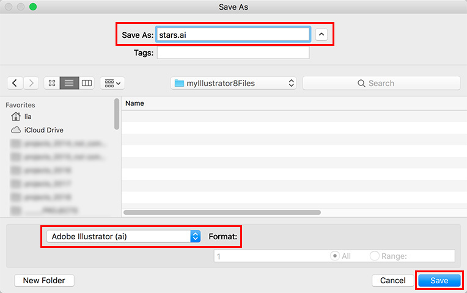

In the next dialog box, choose **Illustrator 8** as the version (other versions WILL NOT WORK with ShapeConverter!)

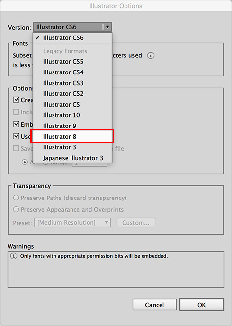

then click OK:

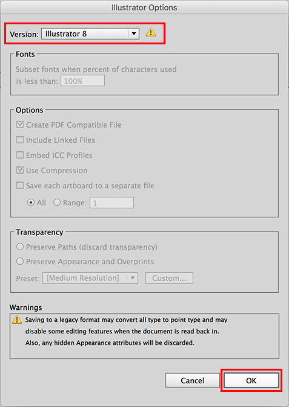

You will still be prompted with another dialog box to make sure you really want to save your file in this old format:

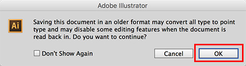

Click ok again.

You have now saved your file in the Adobe Illustrator 8 file format, which is still human readable.

If you are curious to see how the file actually looks like, you can open it in any text editor and have a look. There is a lot (!) of information in the file. Most of it is definitions of "possibilities" (like palettes, gradients and so on). But you only want the coordinates of your shape, right ? 

So if you scroll all the way down, at the bottom of the file you will find a line saying "%AI5_EndLayer--":

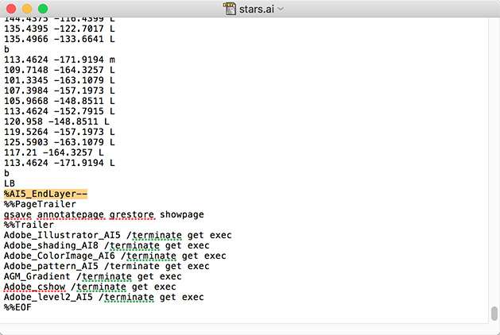

If you slowly scroll up a little bit, you will also find the line saying "%AI5_BeginLayer":

The interesting data that makes your shape is between the "%AI5_BeginLayer" and the "%AI5_EndLayer--" lines. I will not go into detail about the Adobe Illustrator file format here, because this would be way too much for here and it is not essential that you actually know about it at at all. This was just a little side track.

 
#### 4) 
Open the shapeConverter.pde file in your Processing application and click the Run button:

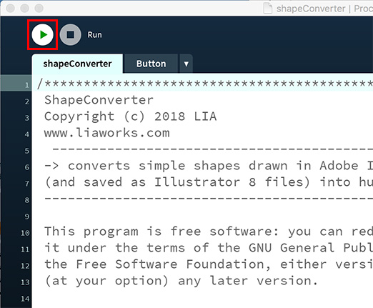

In the ShapeConverter application click the "OPEN ADOBE ILLUSTRATOR 8 FILE" button –>

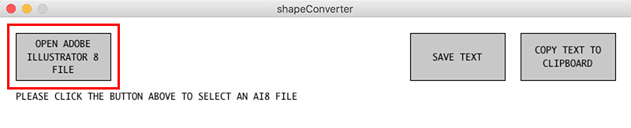

... and select the Illustrator 8 file (.ai) that you saved earlier:

So, open your AI8 file –>

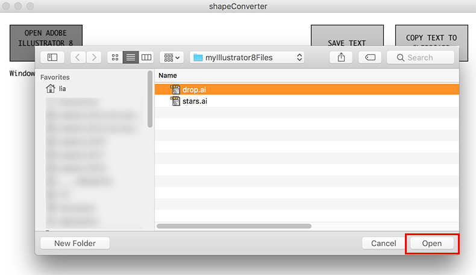

If you get this warning –>

... that means you probably tried to open a file that was saved with a different file format. Make sure you follow the steps above to make sure your file has **Illustrator 8** format !

 
#### 5) 
If everything went well, your shape should appear in the ShapeCoverter window.

The cross indicates where the TOP LEFT corner of your Illustrator document was. In my case I drew the shape with one point at (0,0), and this point lines up with the cross:

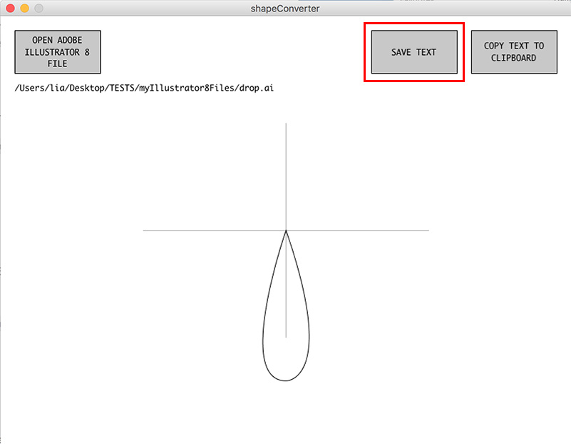

If you can’t see your shape, it might be off-screen. Double check that your Illustrator file is set to use Pixel coordinates and that your shape is near enough to 0,0 that you’d expect to see it in this window.

 
#### 6) 
Get the code! You can save it as a text file or copy it to the clipboard. 

If you choose to save it as a text file, make sure to enter the name AND the .txt text extension to be able to open the file in a text editor of your choice, then click Save –> 

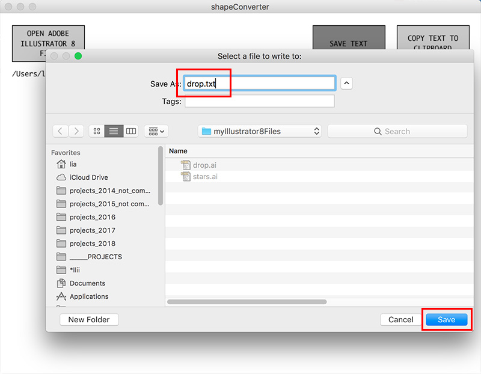

Open this saved text file in a text editor, and copy the text into your Processing project.

Or, you can just click the "COPY TEXT TO CLIPBOARD" button –>

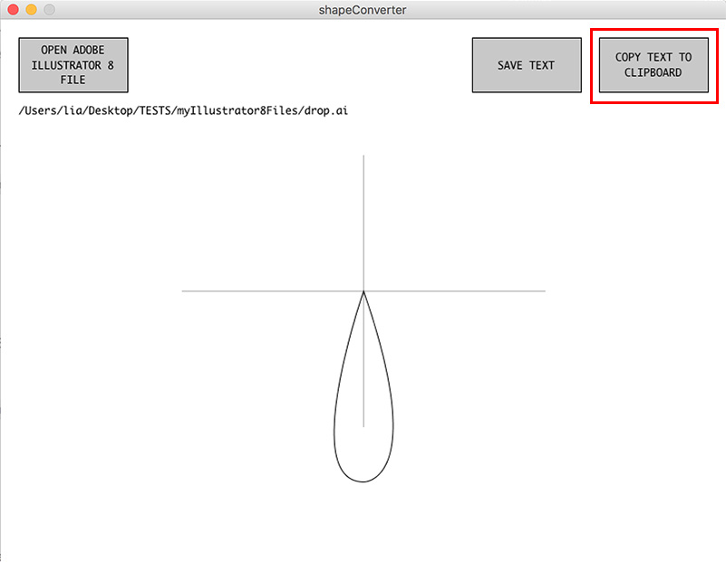

and paste the text into your Processing project.

For the drop shape above, if you paste it into the draw function of processing, just as it is –>

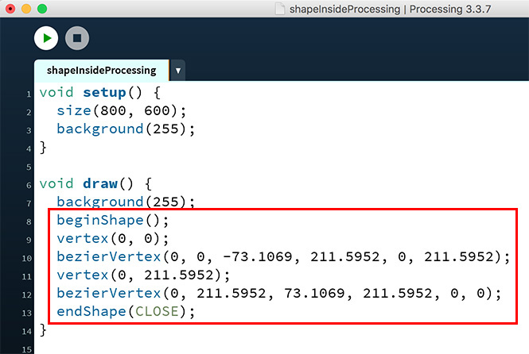

then the drop shape will show up in your processing window on the very TOP LEFT, just as you were drawing it in Illustrator –>

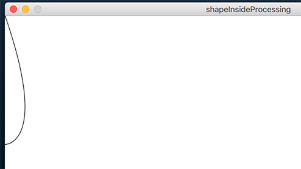

The top tip of my shape here has the coordinates x0, y0.
If you want to move the whole shape somewhere else, you can do this using matrix transformations, like this:

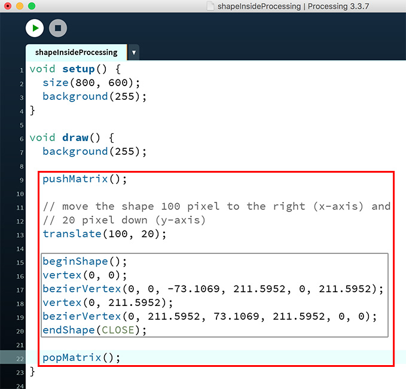

It will look like this –>

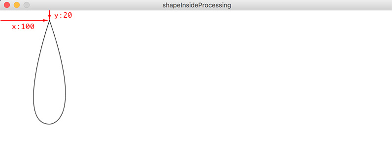

So there are two parts that play a role on where you will see your shape in Processing:
a) where you draw it in Illustrator
b) where you move (or rotate) it with matrix transformations in your Processing code.

That’s it.

### Who maintains and contributes to the project

I am not planning to further develop this app any more (today is the 14th of July and it is way too hot outside), unless it stops working, then I will come back to it and make myself (and for you) another version.
